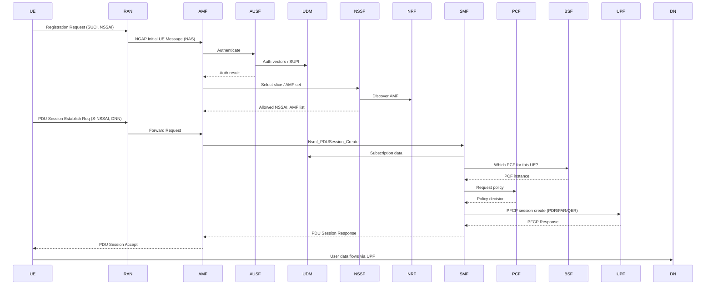

# Acronym Soup

This document serves the purpose of better understanding the acronym soup typically found in networking applications.

## Network Functions

### AMF

Access and Mobility Management Function.
This takes care of handovers when a UE switches from one tower to another.
It also provides connectivity on the go.
In addition, it handles access authentication and authorization.

### AUSF

Authentication Server Function. 
It supports authentication for 3GPP access and untrusted non-3GPP access.
It is probably queried by the AMF when it needs to authenticate a new UE.

### PCF

Policy Control Function.
It provides the control plane with policy rules to enforce.
It also supports unified policy framework to govern network behaviour.

### BSF

Binding Support Function.
Allows a PCF to register/deregister itself and to be discoverable by NF service consumers.
It keeps track of which PCF applies to which UE.
It doesn't assign any particular rights or restrictions to the UE, it merely keeps track of the mapping.
The assigning is done by the PCF.

If you're wondering how come the BSF exists, when one could have just labeled the PCF function with some UE-binding information: scalability!
You don't want other NFs to become dependent of the internal workings of the PCF.
You also don't want to make sure the labels were restored correctly between restarts or similar.

### NRF

Network Repository Function.
An application level gateway.
It can automatically discover NF instances and provide information about them.
In addition, it can notify about newly registered/updated/deregistered NF instances along with its potential NF services to the subscribed NF service consumer.

### NSSF

Network Slice Selection Function.
It selects the set of Network Slice instances serving the UE.
In addition, it determines the AMF Set to be used to serve the UE, or, based on configuration, a list of candidate AMF(s), possibly by querying the NRF.
Furhtermore, it determines whether an S-NSSAI has to be replaced.
In that case, it provides the AMF  with the indication that the S-NSSAI is unavailable and a corresponding Alternative S-NSSAI.

### SCP

Service Communication Proxy.
It acts as a semantic load balancer.
It does forward traffic, but it is slice- and policy-aware.
Traffic is routed based on different conditions, such as NF type, service name UE identifier scope, etc.

Without it, each NF would need to implement extensive retry logic, enforce policy for itself (which is bs), apply routing rules etc.

### UDM

User Dataplane Management.
It is the home subscriber "database" and identity authority.
It stores who the UE is, its long-term keys, subscriptions, and entitlements.
This is the NF other NFs talk to when they need UE data.
UDM always lives in the HPLMN and is consulted whenever the network needs authoritative subscriber info.

### UDR

User Dataplane Repository.
It is the actual DB the UDM talks to.
So the UDM runs the actual business logic, whereas UDR saves the data.
The UDM logic could have be delegated to other NFs, but that risks them from becoming too complex themselves.

### SMF

Session Management Function.
It is the controll plane owner of data sessions.
It decides how a UE’s IP traffic flows through the network.
Bear in mind it only **decides**!
The SMF never touches any traffic on it own!

It was designed to be slice-agnostic.
Thus, there is 1+ in each slice.
It programs the corresponding UPF accordingly and it's done!

### UPF

User Plane Function.
The one that actually does the heavy-lifting of sending packets from 1 place to another.
This is done based on policies, QoS and other inputs configured by the SMF.

### Example

Here's an end-to-end example of the entire flow.

## Configs

### SBI

Service-based interface.
It defines the endpoints the NF is reachable from and how it can reach out to others.

### S-NSSAI

Single Network Slice Selection Assistance Information.
Basically, identifying information on the network slice.
Since 5G supports multiple logical networks on the same infra, you can think of slices as scopes or namespaces for NFs.

Each S-NSSAI consists of:

- SST: slice type
- SD: slice differentiator

### PLMN

Public Land Mobile Network.
This is an operator's mobile network.
It can be identified with the following:

- **MCC**: Mobile Country Code
- **MNC**: Mobile Network Code

There's also:

- **HPLMN**: Home PLMN --> your local network
- **VPLMN**: Visiting --> the network you connect to when you're mobile

### NGAP

Next Generation Application Protocol.
This is what the ground node uses to speak to the AMF.
While the core network is cloud-native, this part actually requires admins pin the ip of the service.
Appearently, the node is very sensitive to changes.

### GUAMI

Globally Unique AMF Identifier.
It consists of PLMN ID, AMF Region ID, AMF Set ID, AMF Pointer.

## Misc

### UE

User Equipment. 
The thing a user uses to access the services of a network.
For example, a mobile phone.

### gNodeB

Ground Node B.
